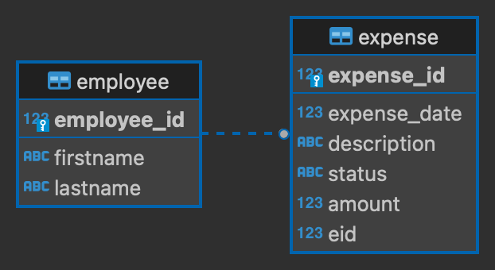

# Employee Expenses

## Overview
A REST API for an expense reimbursement system.
The system will will allow the company to track expenses and analyze spending.

## Entity Relationship Diagram
An employee can have multiple expenses, but an expense can only be issued by one employee.

